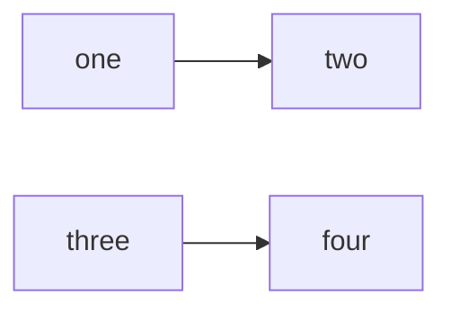

# REDUR

# **** Antes de cualqueir cambio, haz una copia de seguridad ****

## Enfoque actual

1 Solucionar el problema de las llamadas Rest y la asiganción de grupos

------
Fecha Lectura Test

Meta ->  Leer el arreglo entero y después actualizar el valor 


Tenemos doc calidad 

Fecha lectura es un campo 

En el campo, cuando yo hago un get documento y me devuelve todos los valores de ese campo comprendidos en un array.


Una vez coincida la row con con el array, vuelves a meter el array actualizado y lo envio a la categoría de Destino


Miguel 

Alfredo 

Ian

1. getDocument te da un lastchagngeTime -> ma traigino la info, modifico , confecha ultima modificación 

savedocumentindexdata -> es el que necesitas, necesitas un valor, lastchangetime 

------


2. Hablar con Therefore y comentarles la situación que tiene el cliente ahora | Ya se les ha respondido mediante los tickets
    2.1 Somos concientes que tenemos que realizar la actualizaciónm pero preferimos evitarla, ya que el cliente mueve miles de documentops de forma diaria y eso conllevara tiempo de         
    prepararación y actualmente estamos llevando un evolutivo sobre el proyecto y viene otro en camino, por eso la importancia de arreglar esto de la mejor forma posible ahora. 


Enfocarse en conseguir la parte de la llamada rest con el valor de la fila y el número de documento, para saber que tratamos con un dato único

## Pendientes

1. Crear Grupo de Lectores (Maestro) compuesto por:

| Nombre   | ID  | Tabla con Lectores |
|----------|-----|---------------------|
| Lectores | 001 | Lista de Lectores   |


2. Una ves se reuelve el proble de rest, enfocate en tratar mediante un condicional, la situación en la que el cliente no 3. escoge ningún valor .
4. Quitar id del proyecto para que sea más usable de cara al cliente/s finales


## Confirmaciones de dudas

Dejar los campos obligatorios a JJ le parece Ok

| Lenguaje | Config File |
|----------|--------------|
| JavaScript | package.json |


## Example of a Flow Chart

```
This is a codeblack
```


