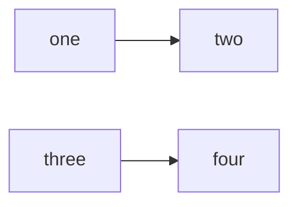

# REDUR

## Enfoque actual

Enfocarse en conseguir la parte de la llamada rest con el valor de la fila y el número de documento, para saber que tratamos con un dato único

## Pendientes 

Crear Grupo de Lectores(Maestro) compuesto por:

| Nombre | ID | Tabla con Lectores|

Una ves se reuelve el proble de rest, enfocate en tratar mediante un condicional, la situación en la que el cliente no escoge ningún valor .
Quitar id del proyecto para que sea más usable de cara al cliente/s finales


## Confirmaciones de dudas

Dejar los campos obligatorios a JJ le parece Ok

| Lenguaje | Config File |
|----------|--------------|
| JavaScript | package.json |
| Ruby | Genfile |
| Python | requirement.txt |
| Rust | Cargo.toml |

## Example of a Flow Chart

```
This is a codeblack
```


